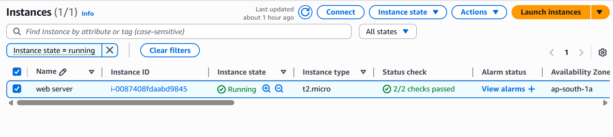
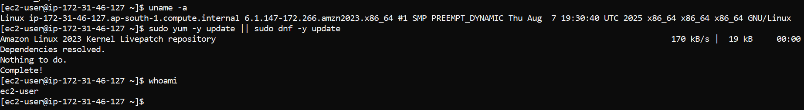
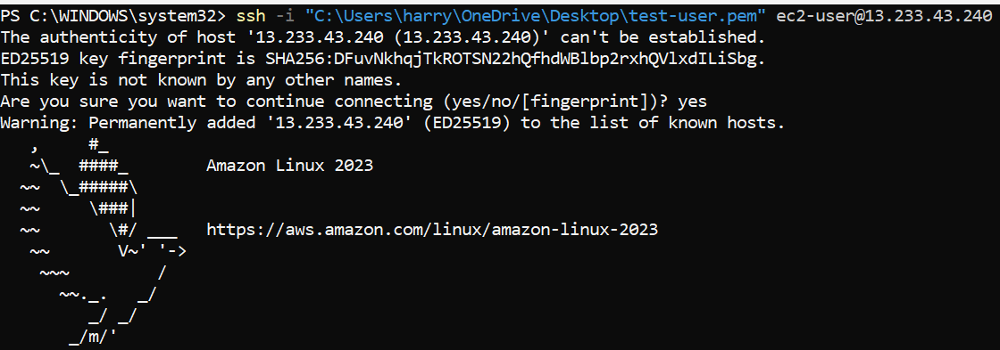
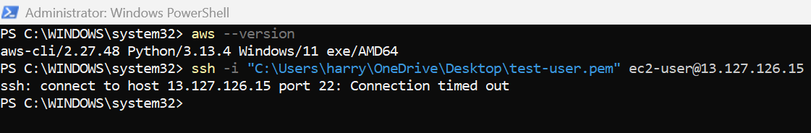
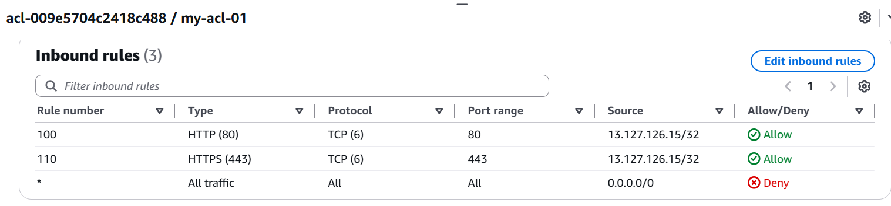
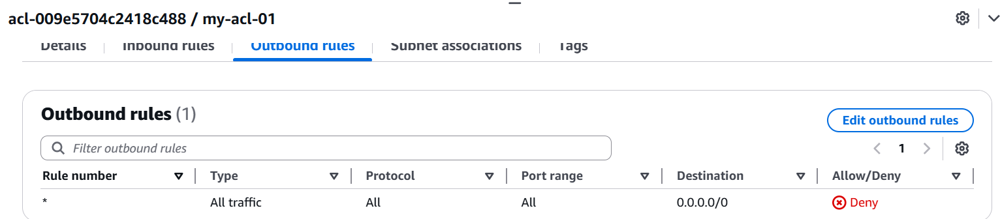
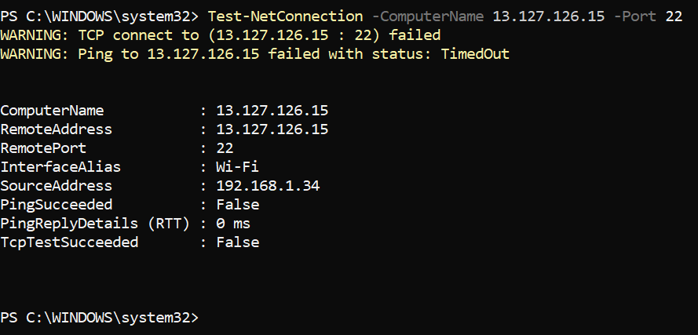
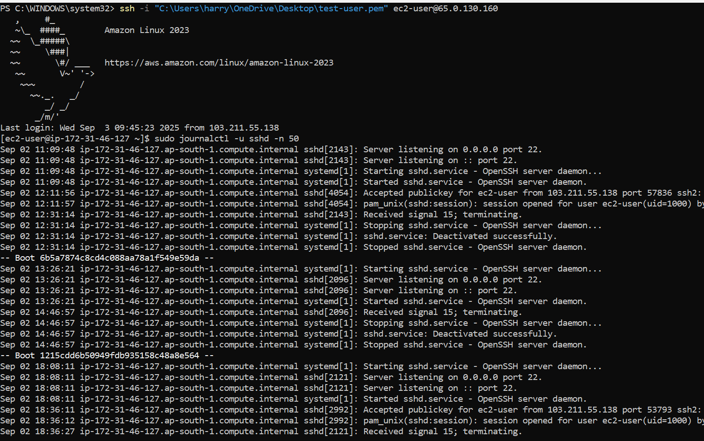
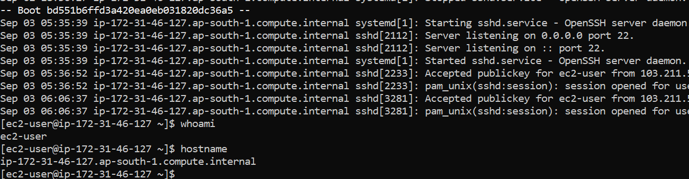

<<<<<<< HEAD
# AWS-Troubleshooting-Labs
=======
# EC2 SSH Troubleshooting

## Problem Statement
SSH connection to EC2 instance was failing (timeout) after security group/NACL misconfiguration.

## Environment Setup
- **Region:** ap-south-1 (Mumbai)  
- **AMI:** Amazon Linux 2023  
- **Instance Type:** t2.micro  
- **Key Pair:** key-pair.pem  
- **Security Group:** SSH (22) allow from laptop IP  
- **Network ACL:** Custom NACL with SSH inbound/outbound rules  
- **Public IPv4:** <EC2 Public IP, changes on restart>

## Steps to Reproduce
1. Launch EC2 and connect initially  
   

2. Baseline system info (`uname -a`)  
   

3. Initial SSH connection successful  
   

4. Delete SG port 22 or deny NACL → SSH timeout  
   

5. Check NACL inbound/outbound rules  
     
   

6. Verify network reachability from laptop  
   

## Error Observed
- SSH timeout in PowerShell  
- `Test-NetConnection -ComputerName -Port 22` failed  

## Investigation
- Checked Security Group rules → port 22 missing/incorrect source  
- Checked NACL inbound/outbound rules → SSH blocked  
- Public IP changed after EC2 stop/start  
- Verified logs inside EC2 (`sudo journalctl -u sshd -n 50`)  

## Root Cause
Port 22 was blocked in either SG or NACL, preventing SSH connection.  

## Solution
1. Add inbound rule in SG: SSH (22) from laptop IP  
2. Add inbound rule in NACL: SSH (22) from laptop IP  
3. Outbound rule in NACL: allow all traffic  
4. Re-test SSH → successful connection 

## Verification

### SSH Success + Logs


### User & Hostname Verification
 

## Commands Used (optional)
```bash
ssh -i key-pair.pem ec2-user@<Public_IP>
sudo journalctl -u sshd -n 50
whoami
hostname
>>>>>>> 7592b07 (Day1: EC2 SSH Troubleshooting documentation)
