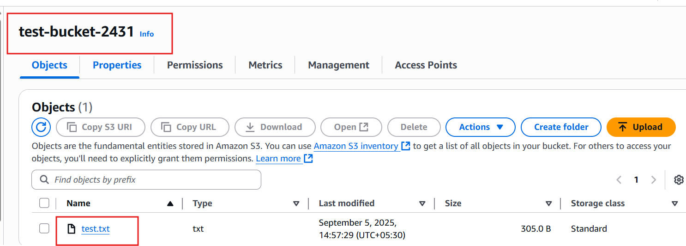
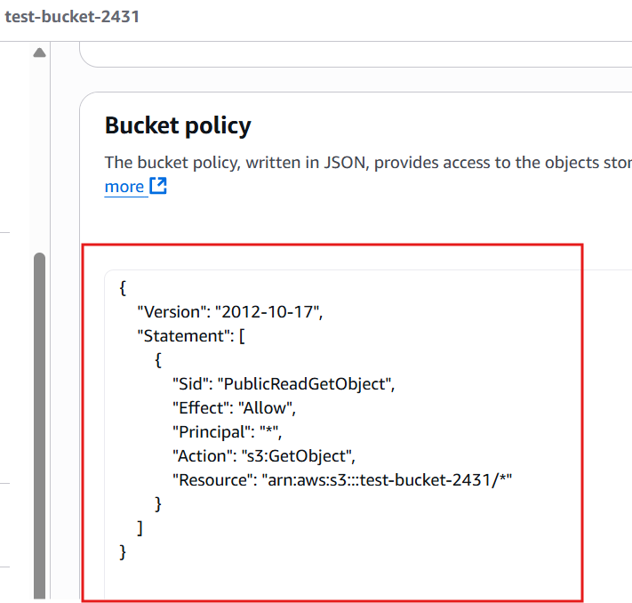

# Scenario 2: S3 Access Denied

# Problem Statement 
An IAM user tried to access an object inside an S3 bucket but consistently received an **Access Denied (403)** error.  
This impacted object availability for applications depending on S3.

# ⚙️ Environment Setup
- **Region:** ap-south-1 (Mumbai)  
- **S3 Bucket:** `test-bucket-2431`  
- **Object:** `test.txt` (sample text file)  
- **IAM User:** `test-user`  
- **Policy Assigned Initially:** AmazonS3FullAccess  
- **Other Settings:** Block Public Access (default: enabled)

## 🔄 Steps to Reproduce
1. Created S3 Bucket  
     

2. Uploaded Object (`test.txt`)  
     

3. Tried accessing the object → Received Access Denied (403)  
     

4. Checked Block Public Access settings → Initially enabled, then turned off  
     

5. Updated Bucket Policy → Added explicit allow for object access  
     

6. Re-tested Access → Successfully accessed object publicly  
     

## ❌ Error Observed
**Exact Error:**  
AccessDenied: Access Denied

**Command Used:**  
aws s3 cp s3://test-bucket-2431/test.txt .

## Investigation

* Verified IAM policy → Already had **AmazonS3FullAccess**
* Checked Bucket Policy → Empty initially
* Confirmed Block Public Access → Enabled by default, blocking access
* Re-tested after updates

## Root Cause

**Block Public Access settings + missing bucket policy** prevented object access despite IAM permissions.

## Solution

1. Disabled Block Public Access at the bucket level.
2. Added explicit Bucket Policy to allow object access.
3. Re-tested object access successfully.

**Verification Commands:**

aws s3 cp s3://test-bucket-2431/test.txt .
cat test.txt

## Impact

* Resolved **AccessDenied** issue.
* Restored access to critical S3 object.
* Learned importance of IAM policies + Bucket policies + Block Public Access interplay.

## Commands Used (Reference)

# Copy object from S3
aws s3 cp s3://test-bucket-2431/test.txt .

# View object content
cat test.txt

# View bucket policy
aws s3api get-bucket-policy --bucket test-bucket-2431

# List objects in bucket
aws s3 ls s3://test-bucket-2431/