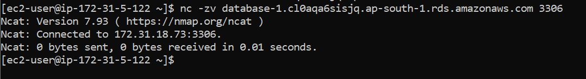

# 🚀 Scenario-4: RDS MySQL Connectivity (EC2 → Private RDS)

## 📝 Problem Statement  
An EC2 instance was unable to connect to an RDS MySQL database.  
The root cause was **Security Group misconfiguration** — RDS inbound port 3306 was not allowed from the EC2 instance.  
This blocked database access and could have led to downtime for any application relying on the DB.  

---

## ⚙️ Environment Setup  
- **Region:** ap-south-1 (Mumbai)  
- **EC2:** Amazon Linux 2023, t2.micro  
- **RDS:** MySQL 8.x, db.t3.micro, Publicly Accessible = No (private)  
- **Key Pair:** `test-user.pem`  
- **Security Groups:**  
  - `ec2-sg` → attached to EC2  
    - Inbound: SSH (22) from 0.0.0.0/0  
    - Outbound: All traffic open  
  - `rds-sg` → attached to RDS  
    - Inbound misconfigured initially  

---

## 🔄 Steps Performed  

### A. Baseline Setup  

1. **SSH into EC2**  
   

2. **Install MySQL client (Amazon Linux 2023 → `mariadb105`)**  
     
   

3. **Check MySQL version**  
   

4. **Note EC2 SG ID from Console**  
   

---

### B. Create RDS Instance  

- Created MySQL RDS instance with **Public Access = No**.  
- Captured RDS creation and endpoint details.  
    
  

---

### C. Simulate Failure  

1. **Install `nmap-ncat` to use nc command**  
     
   

2. **Test TCP connectivity → failed (timeout)**  
   

3. **MySQL client connection attempt → failed**  
   

---

### D. Troubleshooting  

1. **Checked RDS accessibility**  
   - Confirmed **Publicly Accessible = No**.  
   

2. **Identified RDS Security Group**  
   

3. **Reviewed EC2 SG outbound rules (already All traffic open)**  
   

4. **Reviewed RDS SG inbound rules before fix**  
   

5. **Applied Fix**  
   - Added inbound rule: **MySQL/Aurora (3306)**  
   - Source: **EC2 SG (`ec2-sg`)**  
   - This enabled least-privilege connectivity between EC2 and RDS.  
   

---

### E. Verification  

1. **TCP connectivity successful**  
   

2. **MySQL client connection successful**  
   

3. **Database operations validated**  
   - Created DB, table, inserted a row, and queried data successfully.  
   

---

### F. Cleanup  

To avoid extra costs, deleted the RDS instance.  
  

---

## 🛑 Root Cause  
RDS SG inbound rules only allowed traffic from the default SG.  
Since EC2 was in a different SG, its traffic on port 3306 was blocked.  

---

## ✅ Solution  
Added a **MySQL/Aurora (3306)** inbound rule to the RDS SG, with the EC2 SG as the source.  
This enabled secure, private connectivity between EC2 and RDS without exposing the database publicly.  

---

## 📊 Impact  
- Restored EC2 → RDS connectivity securely.  
- Avoided making RDS publicly accessible, reducing attack surface.  
- Applied best practice of **SG-to-SG rules** for least privilege access.  

---

## 🔧 Commands Used  

# Install MySQL client
sudo dnf install -y mariadb105

# Test TCP connectivity
nc -zv <RDS_ENDPOINT> 3306

# Connect to RDS
mysql -h <RDS_ENDPOINT> -u admin -p
